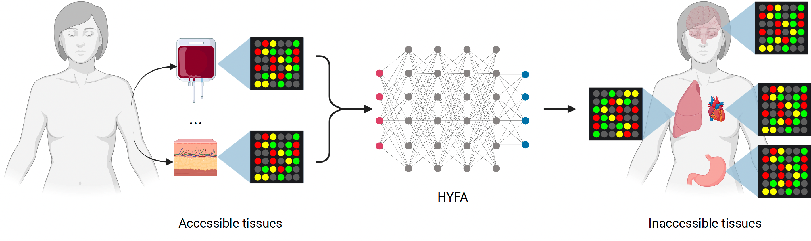
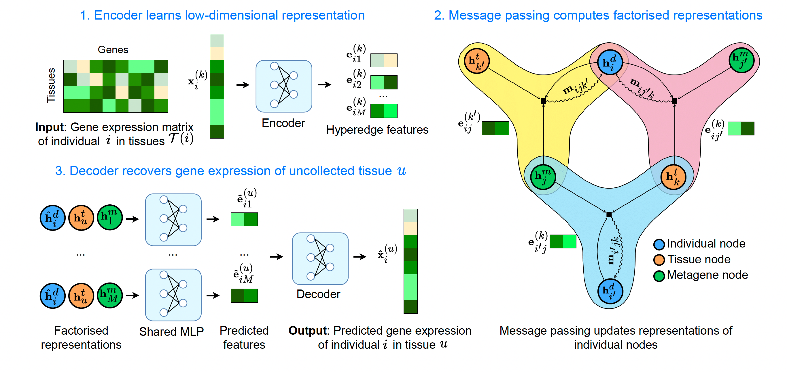

# Hypergraph Factorisation for Multi-Tissue Gene Expression Imputation

Welcome to the repository of *[Hypergraph Factorisation for Multi-Tissue Gene Expression Imputation](https://www.biorxiv.org/content/10.1101/2022.07.31.502211)*  — HYFA.

**Overview of HYFA**


> HYFA processes gene expression from a number of collected tissues (e.g. accessible tissues) and infers the transcriptomes of uncollected tissues.

**HYFA Workflow**



> 1. The model receives as input a variable number of gene expression samples $x^{(k)}\_i$ corresponding to the collected tissues $k \in \mathcal{T}(i)$ of a given individual $i$. The samples $x^{(k)}\_i$ are fed through an encoder that computes low-dimensional representations $e^{(k)}\_{ij}$ for each metagene $j \in 1 .. M$. A *metagene* is a latent, low-dimensional representation that captures certain gene expression patterns of the high-dimensional input sample. 
> 2. These representations are then used as hyperedge features in a message passing neural network that operates on a hypergraph. In the hypergraph representation, each hyperedge labelled with $e^{(k)}\_{ij}$ connects an individual $i$ with metagene $j$ and tissue $k$ if tissue $k$ was collected for individual $i$, i.e. $k \in \mathcal{T}(i)$. Through message passing, HYFA learns factorised representations of individual, tissue, and metagene nodes. 
> 3. To infer the gene expression of an uncollected tissue $u$ of individual $i$, the corresponding factorised representations are fed through a multilayer perceptron (MLP) that predicts low-dimensional features $e^{(u)}\_{ij}$ for each metagene $j \in 1 .. M$. HYFA finally processes these latent representations through a decoder that recovers the uncollected gene expression sample $\hat{x}^{(u)}\_{ij}$.


## Installation
1. Clone this repository: ```git clone https://github.com/rvinas/HYFA.git```
2. Install the dependencies via the following command:
```pip install -r requirements.txt```

The installation typically takes a few minutes.

## Data download
To download the processed GTEx data, please follow these steps:
```
wget -O data/GTEx_data.csv.zip https://figshare.com/ndownloader/files/40208074
wget -O data/GTEx_Analysis_v8_Annotations_SubjectPhenotypesDS.txt https://storage.googleapis.com/gtex_analysis_v8/annotations/GTEx_Analysis_v8_Annotations_SubjectPhenotypesDS.txt
unzip data/GTEx_data.csv.zip -d data
```

To download the pre-trained model, please run this command:
```
wget -O data/normalised_model_default.pth https://figshare.com/ndownloader/files/40208551
```

## Running the model
1. Prepare your dataset:
   * By default, the script `train_gtex.py` loads a dataset from a CSV file (`GTEX_FILE`) with the following format:
     * Columns are genes and rows are samples.
     * Entries correspond to normalised gene expression values.
     * The first row contains gene identifiers.
     * The first column contains donor identifiers. The file might contain multiple rows per donor.
     * An extra column `tissue` denotes the tissue from which the sample was collected. The combination of donor and tissue identifier is unique.  
   * The metadata is loaded from a separate CSV file (`METADATA_FILE`; see function `GTEx_metadata` in `train_gtex.py`). Rows correspond to donors and columns to covariates. By default, the script expects at least two columns: `AGE` (integer) and `SEX` (integer). 
   
   
   Example of gene expression CSV file:
     ```
     , GENE1, GENE2, GENE3, tissue
     INDIVIDUAL1, 0.0, 0.1, 0.2, heart
     INDIVIDUAL1, 0.0, 0.1, 0.2, lung
     INDIVIDUAL1, 0.0, 0.1, 0.2, breast
     INDIVIDUAL2. 0.0, 0.1, 0.2, kidney
     INDIVIDUAL3, 0.0, 0.1, 0.2, kidney
     ```
   
   Example of metadata CSV file:
   ```
   , AGE, SEX
   INDIVIDUAL1, 34, 0
   INDIVIDUAL2. 55, 1
   INDIVIDUAL3, 49, 1
   ```

2. Run the script `train_gtex.py` to train HYFA. This uses the default hyperparameters from `config/default.yaml`. After training, the model will be stored in your current working directory. We recommend training the model on a GPU machine (training takes between 15 and 30 minutes on a NVIDIA TITAN Xp).

3. Once the model is trained, evaluate your results via the notebook `evaluate_GTEx_v8_normalised.ipynb`.
<!--- The function `GTEx_v8_normalised_adata` populates an [`AnnData`](https://anndata.readthedocs.io/en/latest/) object. --->

## Quick reference of main files
- `train_gtex.py`: Main script to train the multi-tissue imputation model on normalised GTEx data
- `evaluate_GTEx_v8_normalised.ipynb`: Analysis of multi-tissue imputation quality on normalised data (i.e. model trained via `train_gtex.py`)
- `evaluate_GTEx_v9_signatures_normalised.ipynb`: Analysis of cell-type signature imputation (i.e. fine-tunes model on GTEx-v9)

### Data
- `src/data.py`: Data object encapsulating multi-tissue gene expression
- `src/dataset.py`: Dataset that takes care of processing the data
- `src/data_utils.py`: Data utilities

### Model
- `src/hnn.py`: Hypergraph neural network
- `src/hypergraph_layer.py`: Message passing on hypergraph
- `src/hnn_utils.py`: Hypergraph model utilities
- `src/metagene_encoders.py`: Model transforming gene expression to metagene values
- `src/metagene_decoders.py`: Model transforming metagene values to gene expression

### Training
- `src/train_utils.py`: Train/eval loops
- `src/distribions.py`: Count data distributions
- `src/losses.py`: Loss functions for different data likelihoods

### Other utils
- `src/pathway_utils.py`: Utilities to retrieve KEGG pathways
- `src/ct_signature_utils.py`: Utilities for inferring cell-type signatures

## Citation
If you use this code for your research, please cite our paper:
```
@article{Vinas2022Hypergraph,
	author = {Vinas Torne, Ramon and Joshi, Chaitanya K. and Georgiev, Dobrik and Dumitrascu, Bianca and Gamazon, Eric and Lio, Pietro},
	title = {Hypergraph factorisation for multi-tissue gene expression imputation},
	elocation-id = {2022.07.31.502211},
	year = {2022},
	doi = {10.1101/2022.07.31.502211},
	publisher = {Cold Spring Harbor Laboratory},
	URL = {https://www.biorxiv.org/content/10.1101/2022.07.31.502211v3},
	eprint = {https://www.biorxiv.org/content/10.1101/2022.07.31.502211v3.full.pdf},
	journal = {bioRxiv}
}
```
